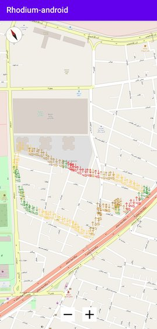
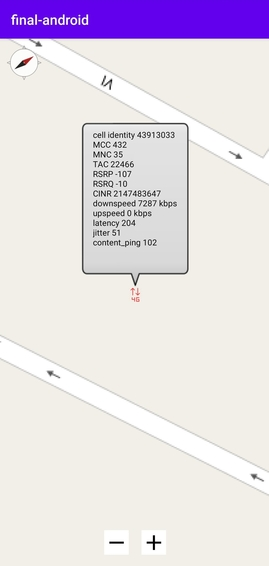
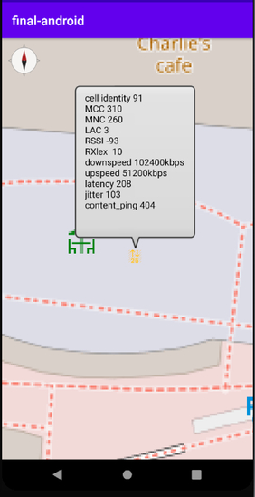

## Rhodium android project

This app is a great endeavour for measuring and showing mobile network data which are captured in real-time manner and then being displayed on map.

## Contributers

Mohamad Mahdi Yadegar  96522051

Seyed Hamidreza Sanaei karahroodi  96521137

## librarires

```gradle
implementation 'com.karumi:dexter:6.1.2'
implementation "androidx.room:room-runtime:2.2.5"
kapt "androidx.room:room-compiler:2.2.5"
implementation 'org.osmdroid:osmdroid-android:6.1.6'
implementation 'com.google.android.gms:play-services-location:17.0.0'
```
As you can see we used these libraries for our project.

The dexter used for permission handling.

The Room as you know which is the default android library for offline database is used as our ORM database.

The OSM which is an open source map library is what you see in the map section.

And google play service for capturing location.

Also the network data is coming from android [telephony manager](https://developer.android.com/reference/android/telephony/package-summary).

Some features has gotten from Connectivity manager.

## Implementation

We used latest version of kotlin and gradle to present the best performance possible on android devices.

A simplified flow of the app will be as the following description:

when the start button is pressed ,the app starts getting location by google service . Also there is a timer by using which ,app calculates demanding data from telephony every 10 seconds and then saves the data in the DB.

In map activity the data is being queried from database and being shown on map according to the fields.

## Running example







